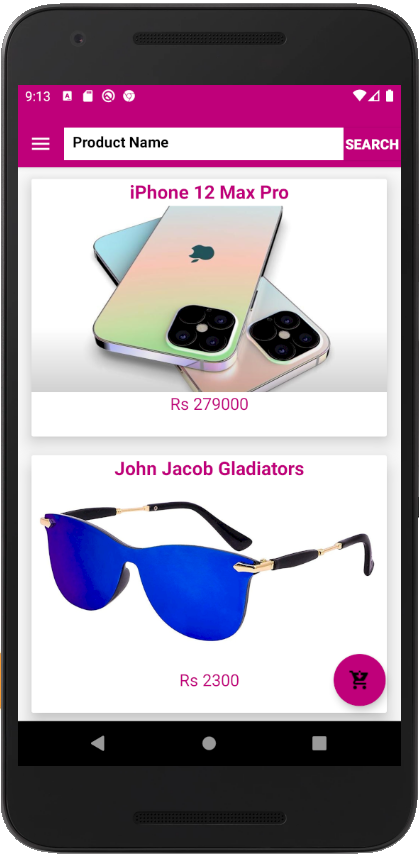

# ECommerce Android Application
### An native android application designed for hassle free purchasing of products online.

## Features

#### Users
- Login/Register
- Browse Product
- Search Product
- Add to Cart
- Update User Profile
- Place order
#### Admin
- Add/modify products
- View & change Status of Orders

## Technologies 
- Java
- Firebase 
- Android Studio

## Local Machine Set-up

- Android Studio (v 4.1.1 or later)
- Used Firebase nosql Database

## Rate This Repo with Stars
